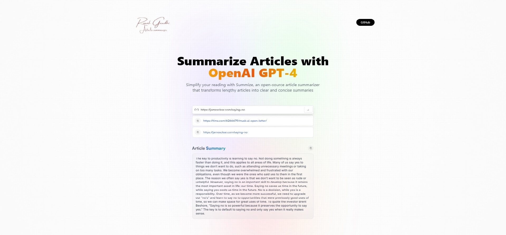

[Lets Try this Summarizer](https://lets-summarize.surge.sh)


## About
This application utilizes OpenAI's GPT model to provide a summarization functionality for articles. It leverages the power of natural language processing and machine learning to condense lengthy articles into concise summaries, enabling users to quickly grasp the main points and key information of any given text.


## Features

- **Summarization**: The application uses OpenAI's GPT model to generate accurate and coherent summaries of articles.
- **Interactive Interface**: The user-friendly interface allows for seamless interaction, making it easy for users to input articles and obtain summaries.
- **Efficient Processing**: The application's backend is optimized for speed and efficiency, delivering quick and reliable summaries.

## Technologies Used
The Article Summarizer Application incorporates a variety of cutting-edge technologies to deliver its powerful functionality and exceptional user experience. Here are the key technologies utilized in building this application:

- **[Vite](https://vitejs.dev/)**: The application is built with Vite, a fast and efficient development tool that optimizes the development experience by offering lightning-fast startup times and instant hot module replacement.

- **[https://react.dev/](React.js)**: The frontend of the application is developed using React.js, a popular JavaScript library known for its component-based architecture, reusability, and efficient rendering.

- **[https://tailwindcss.com/](Tailwind)**: Tailwind CSS is employed for styling the application, providing a highly customizable and utility-first approach that enables developers to rapidly build responsive and visually appealing user interfaces.

- **OpenAI GPT Model**: The core functionality of summarizing articles is powered by OpenAI's GPT model, a state-of-the-art language model that utilizes deep learning techniques to generate accurate and coherent summaries.

- **[https://redux-toolkit.js.org/](Redux)**: Redux Toolkit is utilized to streamline state management in the application. It provides a set of tools and abstractions that simplify the process of managing and updating state, making it easier to build complex and scalable React applications.

- **[https://rapidapi.com/hub](RapidAPI)**: The application integrates with RapidAPI, a leading API marketplace, to access the article data and leverage the necessary APIs for retrieving content from various sources.

## Installation

To use the Article Summarizer Application, follow these steps:

1. Clone the repository:
   ```shell
   git clone https://github.com/ronak1311/article_summarizer.git
2. Navigate to the project directory:
   ```shell
   cd article-summarizer
3. Install the required dependencies:
   ```shell
   npm install
4. Start Application :
   ```shell
   npm run dev
   
Access the application through your web browser at http://127.0.0.1:5173/
   
   
Contributing
Contributions are welcome! If you'd like to contribute to the Article Summarizer Application, please follow these steps:

1. Fork the repository.

2. Create a new branch:
   ```shell
   git checkout -b feature/your-feature-name
3. Make your changes and commit them:
   ```shell
   git commit -m "Add your commit message"
4. Push your changes to your forked repository:
   ```shell
   git push origin feature/your-feature-name
5. Open a pull request on the original repository, describing your changes in detail.
